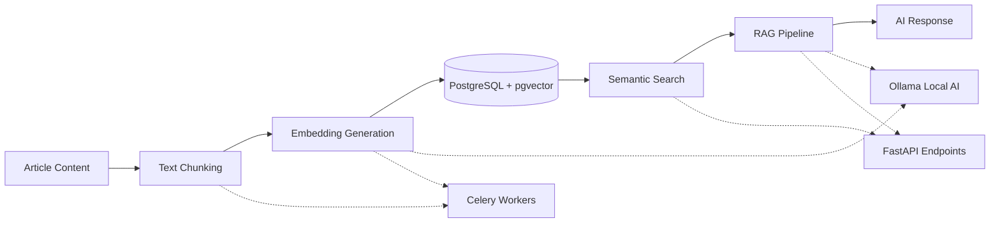
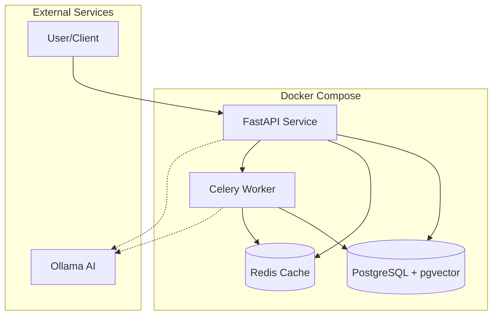

# Article Index Project Structure

```mermaid
graph TB
    %% Project Root
    Root[article_index/] --> DockerCompose[docker-compose.yml]
    Root --> Schema[schema.sql]
    Root --> Indexes[indexes.sql]
    Root --> Env[.env.example]
    Root --> Readme[README.md]
    Root --> Test[test_api.sh]

    %% API Service
    Root --> API[api/]
    API --> APIReq[requirements.txt]
    API --> APIDocker[Dockerfile]
    API --> APIMain[app.py]
    API --> Ollama[ollama_client.py]
    API --> Database[database.py]
    API --> Processor[processor.py]

    %% Worker Service
    Root --> Worker[worker/]
    Worker --> WorkerReq[requirements.txt]
    Worker --> WorkerDocker[Dockerfile]
    Worker --> WorkerMain[app.py]
    Worker --> Celery[celery_app.py]
    Worker --> Tasks[tasks.py]

    %% Skills Directory
    Root --> Skills[.windsurf/skills/]
    Skills --> Skill1[pgvector-rag-article-index/]
    Skills --> Skill2[vector-databases-ai/]
    Skills --> Skill3[python-pro/]
    Skills --> Skill4[ancoleman-using-vector-databases/]

    %% Skill1 Structure
    Skill1 --> Skill1MD[SKILL.md]
    Skill1 --> Skill1Scripts[scripts/]
    Skill1 --> Skill1Assets[assets/]
    Skill1Scripts --> SchemaSQL[schema.sql]
    Skill1Scripts --> IndexSQL[indexes.sql]
    Skill1Scripts --> OllamaScript[ollama_client.py]
    Skill1Assets --> DockerYML[docker-compose.yml]
    Skill1Assets --> EnvExample[.env.example]
    Skill1Assets --> TestScript[test_api.sh]

    %% Skill2 Structure
    Skill2 --> Skill2MD[SKILL.md]
    Skill2 --> Skill2Scripts[scripts/]
    Skill2 --> Skill2Refs[references/]
    Skill2 --> Skill2Examples[examples/]
    Skill2Scripts --> EmbedScript[generate_embeddings.py]
    Skill2Scripts --> EvalScript[evaluate_rag.py]
    Skill2Scripts --> BenchScript[benchmark_similarity.py]
    Skill2Refs --> QdrantRef[qdrant.md]
    Skill2Refs --> PgvectorRef[pgvector.md]
    Skill2Examples --> QdrantExample[qdrant-python/]
    Skill2Examples --> PgvectorExample[pgvector-prisma/]

    %% Styling
    classDef root fill:#e1f5fe
    classDef api fill:#f3e5f5
    classDef worker fill:#e8f5e8
    classDef skills fill:#fff3e0
    classDef files fill:#f5f5f5
    
    class Root root
    class API,APIMain,Ollama,Database,Processor api
    class Worker,WorkerMain,Celery,Tasks worker
    class Skills,Skill1,Skill2,Skill3,Skill4 skills
    class DockerCompose,Schema,Indexes,Env,Readme,Test,APIReq,APIDocker,WorkerReq,WorkerDocker files
```

## Project Architecture Overview

### 🏗️ **Core Application Stack**
- **PostgreSQL + pgvector**: Vector database for semantic search
- **Redis**: Caching and task queue
- **FastAPI**: REST API service
- **Celery**: Background processing workers
- **Ollama**: Local AI processing (embeddings + generation)

### 📁 **Service Structure**

#### **API Service** (`api/`)
- `app.py`: Main FastAPI application with RAG endpoints
- `ollama_client.py`: Ollama integration for embeddings and generation
- `database.py`: Async PostgreSQL operations with vector support
- `processor.py`: Article chunking and embedding pipeline

#### **Worker Service** (`worker/`)
- `app.py`: Celery worker entry point
- `celery_app.py`: Celery configuration and setup
- `tasks.py`: Background tasks for article processing

### 🎯 **Skills Integration**

#### **pgvector-rag-article-index**
- Custom skill for this specific project
- Database schemas and API templates
- Docker configuration and testing scripts

#### **vector-databases-ai**
- Comprehensive vector database guidance
- Multi-provider embedding scripts
- Performance benchmarking tools
- RAG evaluation framework

### 🔄 **Data Flow Architecture**

### 🚀 **Deployment Architecture**

### 📊 **Key Features**

1. **Semantic Search**: Vector similarity search with configurable thresholds
2. **RAG Q&A**: Question answering with retrieved context
3. **Local AI Processing**: No external API dependencies with Ollama
4. **Background Processing**: Async article processing with Celery
5. **Performance Optimized**: Vector indexes and batch operations
6. **Production Ready**: Docker deployment with health checks

### 🔧 **Configuration Files**

- **docker-compose.yml**: Multi-service orchestration
- **schema.sql**: Database schema with vector functions
- **indexes.sql**: Performance optimization indexes
- **.env.example**: Environment configuration template
- **requirements.txt**: Python dependencies for each service

This structure provides a complete, production-ready article indexing system with semantic search and RAG capabilities, all powered by local AI processing through Ollama.
